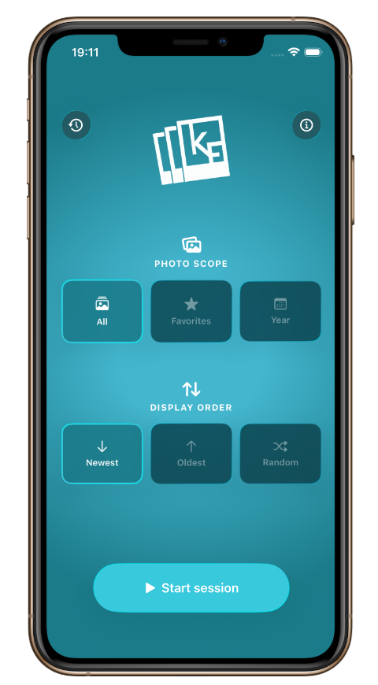
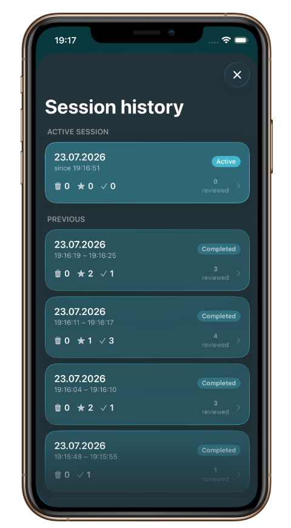
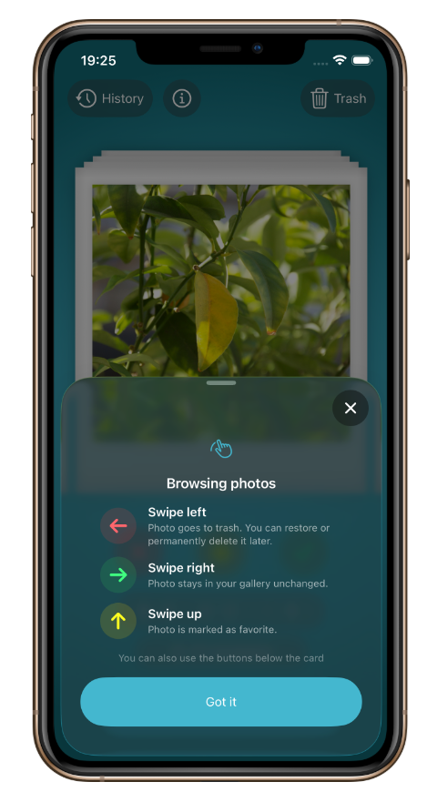
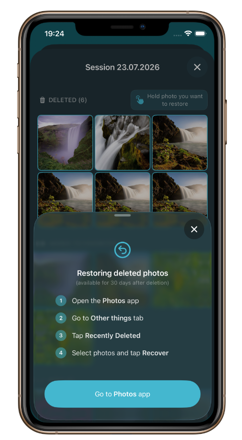
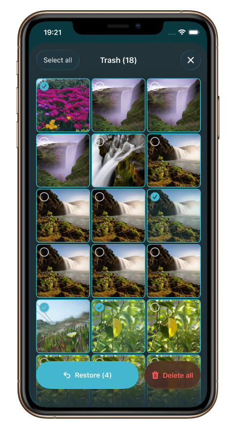

<h1 align="left"> KeepFrame</h1>

> **Photo library declutter app for iOS** - swipe through your photos on Polaroid-styled cards to keep, delete, or favorite. Built entirely in Swift with zero external dependencies.

---

## About

KeepFrame helps you declutter your photo library - **fast**. Photos appear as Polaroid-styled cards in a swipeable deck, one on top of the other. Swipe left to delete, right to keep, up to favorite. It's like Tinder for your camera roll.

Every decision happens inside a **session** - a focused review window where your progress is tracked and saved as you go. You can pause, resume, or end a session at any time. Deleted photos never disappear immediately - they land in an in-app **trash bin** where you can restore them before confirming permanent deletion.

The whole experience runs in a **dark, turquoise-themed UI** with glass-effect components and smooth spring animations throughout.

---

## How it works

1. Choose your photo scope - **all photos**, **favorites only**, or a **specific year**
2. Pick the display order - **newest**, **oldest**, or **random**
3. Tap **Start session** and swipe through the deck:
   - ⬅️ **Swipe left** → move to trash
   - ➡️ **Swipe right** → keep
   - ⬆️ **Swipe up** → add to system favorites
4. When you're done, **end the session** - permanently delete the trashed photos, or discard the trash without deleting anything
5. Revisit past sessions anytime in **Session History**, with a full per-photo breakdown

Deleted photos are moved to the system **Recently Deleted** album, so they stay recoverable for 30 days even after you leave the app. KeepFrame is fully localized in **🇬🇧 English** and **🇵🇱 Polish** via `Localizable.xcstrings` - switch your device language to see it in action.

---

## Screenshots

### 🚀 Getting started & review workflow

&nbsp;&nbsp;&nbsp;&nbsp;&nbsp;&nbsp;&nbsp;&nbsp;
&nbsp;&nbsp;&nbsp;&nbsp;&nbsp;&nbsp;&nbsp;&nbsp;

| Welcome screen | Session configuration | Gesture reference |
|:-:|:-:|:-:|
| Initial entry screen introducing the app with the custom glass-effect interface and quick access to the review workflow | Configure a review session by selecting the photo scope, optional year filter, and display order before loading the deck | Built-in gesture guide explaining every available swipe action and the complete review workflow before starting a session |

---

### 🃏 Review sessions & history

&nbsp;&nbsp;&nbsp;&nbsp;&nbsp;&nbsp;&nbsp;&nbsp;
&nbsp;&nbsp;&nbsp;&nbsp;&nbsp;&nbsp;&nbsp;&nbsp;

| Swipe deck | Trash management | Session history |
|:-:|:-:|:-:|
| Swipe-driven Polaroid card stack with physics-based animations and three directional actions: keep, delete, and favorite | Review photos marked for deletion, restore individual items, or permanently remove the trash when completing a session | Persistent session history stored with SwiftData, including per-session statistics, progress, and detailed review results |

---

## Tech stack

| Technology | Role |
|---|---|
| **Swift** | Entire codebase - no Objective-C, no bridges |
| **SwiftUI** | Declarative UI with spring animations, glass effects (`.glassEffect`), and a 3D card flip |
| **SwiftData** | On-device persistence for session history - survives app restarts |
| **PhotoKit (`Photos` framework)** | Full access to the photo library - fetch, delete, favorite, and filter by year |
| **URLSession / Async-await concurrency** | Modern Swift concurrency for thumbnail loading and photo operations |
| **`Localizable.xcstrings`** | Full localization in 🇬🇧 English and 🇵🇱 Polish |
| **MVVM architecture** | Clean separation with an `@Observable` view model, models, services, and views |

---

## Key features

- **Polaroid card deck** - photos rendered as realistic Polaroid frames with depth-stacked cards behind
- **Card flip animation** - the first card slides in from below and flips with a diagonal shimmer reveal
- **Swipe gestures + buttons** - drag to dismiss or tap the action buttons below the deck
- **Session system** - start, pause, resume, and end sessions with full progress persistence
- **Trash bin** - review deleted photos and restore individual items back into the deck
- **Favorites-only mode** - run a session exclusively on your system-favorited photos
- **Year filtering** - declutter photos from one specific year at a time
- **Sort order** - newest first, oldest first, or shuffled randomly
- **Session history** - browse every past session with a per-photo thumbnail grid
- **Session complete screen** - celebratory summary at the end of a session, with the option to review the trash before finalizing deletions
- **Compact number formatting** - large counts displayed as `1.2k`, `2.5M`
- **Glass effect UI** - iOS 26 `.glassEffect` modifier used throughout the interface
- **Dark mode only** - enforced via `.preferredColorScheme(.dark)` with a custom turquoise palette

---

## Running the app

1. **Clone** the repository
2. Open **`KeepFrame.xcodeproj`** in Xcode
3. Build and run on a simulator or device running **iOS 26+**
4. Grant photo library access when prompted
5. Choose your scope & sort order, tap **Start session**, and start swiping

> No API keys. No packages to install. No setup. Just build and run.

---

## Contact

✉️ [patrykneubauerdev@gmail.com](mailto:patrykneubauerdev@gmail.com)

💼 [linkedin.com/in/patryk-neubauer](https://www.linkedin.com/in/patryk-neubauer)

---

*Thanks for stopping by! 👋*
